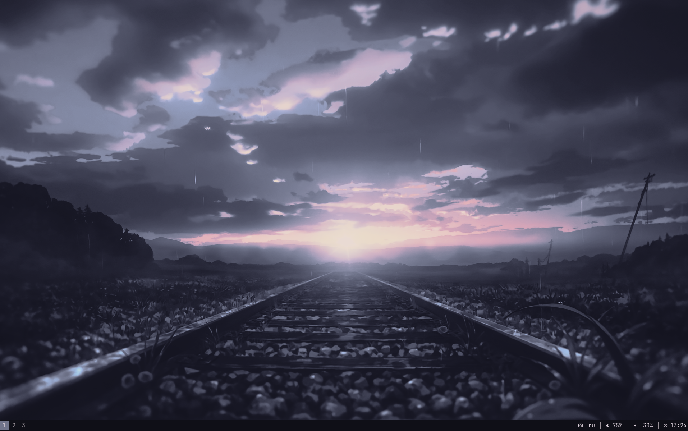
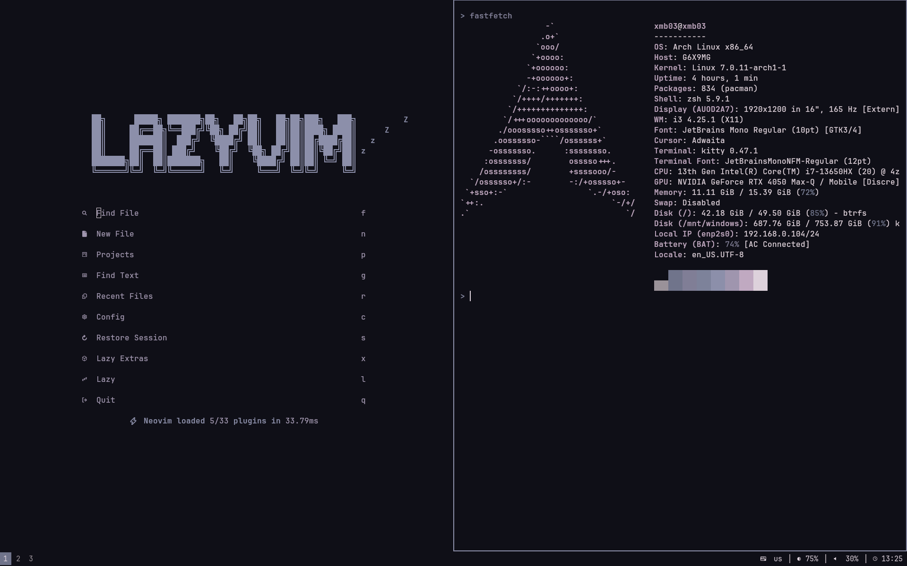

# Dotfiles — xmb03

Personal i3wm dotfiles with pywal-driven colorscheming.

<p align="center">
  
  
</p>

## Features

- **i3** — modular config split into `user/` (personal) and `system/` (distribution-agnostic)
- **JetBrains Mono Regular** — единый системный шрифт (GTK, Qt, терминал, i3, rofi, zathura)
- **pywal** — single wallpaper pick changes colors across the entire desktop (kitty, rofi, i3, zathura, nvim, zsh, gtk)
- **rofi** — app launcher, clipboard manager (`greenclip`), window switcher
- **Neovim** — LazyVim distribution with `neopywal.nvim` colorscheme
- **i3status-rust** — status bar with keyboard layout, volume, backlight, network monitor, clock
- **Zsh** — autosuggestions + syntax highlighting with dynamic pywal colors
- **nmtui** — TUI network settings via `$mod+n` or right-click on net block in bar

## Structure

| Directory | Description |
|---|---|
| [`i3/`](i3/README.md) | i3wm modular config (user/ + system/ layers), i3status-rust, scripts |
| [`kitty/`](kitty/README.md) | Terminal emulator |
| [`nvim/`](nvim/README.md) | Neovim (LazyVim + neopywal) |
| [`rofi/`](rofi/README.md) | App launcher / clipboard / window switcher |
| [`zathura/`](zathura/README.md) | PDF viewer (pywal-driven via include) |
| [`gtk-3.0/`](gtk-3.0/README.md) | GTK3 settings + dark theme |
| [`gtk-4.0/`](gtk-4.0/README.md) | GTK4 settings + dark theme |
| [`fontconfig/`](fontconfig/README.md) | Font aliases → JetBrainsMono Nerd Font |
| [`shell/`](shell/README.md) | Zsh, Bash, Xresources, xprofile |
| [`gammastep/`](gammastep/README.md) | Blue light filter (redshift replacement) |
| [`qtengine/`](qtengine/README.md) | Qt theme engine config |
| [`wal/`](wal/README.md) | pywal templates (zathura, etc.) |
| [`xorg-conf.d/`](xorg-conf.d/30-touchpad.conf) | Xorg input config (touchpad) |
| [`dconf/`](dconf/README.md) | GSettings dump |

## Keybindings

| Key | Action |
|---|---|
| `$mod+d` | Rofi app launcher |
| `$mod+v` | Rofi clipboard manager (greenclip) |
| `$mod+Tab` | Rofi window switcher |
| `$mod+w` | Firefox |
| `$mod+a` | Wallpaper picker |
| `$mod+n` | Network settings (nmtui) |
| `Print` | Full screenshot (flameshot) |
| `$mod+Shift+s` | Region screenshot (flameshot) |
| `$mod+j/k/l/;` | Focus (vim-style, also arrows) |
| `$mod+Shift+j/k/l/;` | Move window |
| XF86Audio{Lower,Raise,Mute}Volume | Volume controls |
| `$mod+r` | Resize mode |
| `$mod+1-0` | Workspace switch |

### i3bar clicks

| Block | Left-click | Right-click | Middle-click |
|---|---|---|---|
| 🌐 net | Toggle speed view | nmtui | — |
| ⌨ keyboard | Toggle layout | — | — |
| ⏻ power | Power menu | — | — |

## Color Scheme

The entire desktop is themed by **pywal** — run the wallpaper picker (`$mod+a`) to select an image, and pywal generates a 16-color palette that applies to:

- **kitty** — `JetBrains Mono` family, `include colors-kitty.conf`
- **rofi** — `JetBrains Mono Regular`, `@import colors-rofi-dark.rasi`
- **i3** — `JetBrains Mono Regular`, `set_from_resource` via Xresources
- **zathura** — `JetBrains Mono Regular`, `include` generated colors from `colors-zathurarc`
- **neovim** — JetBrainsMono Nerd Font Mono, neopywal.nvim
- **zsh** — syntax highlighting colors from wal variables
- **GTK3/GTK4** — `JetBrains Mono Regular 10`
- **Qt** — `JetBrains Mono` via qtengine
- **fuzzel** — `JetBrains Mono NF`

## Applications

| App | Purpose |
|---|---|
| i3 | Window manager |
| kitty | Terminal |
| neovim | Editor (LazyVim) |
| rofi | Launcher / clipboard / window switcher |
| i3status-rust | Status bar |
| zathura | PDF viewer |
| nmtui | Network settings (TUI) |
| dunst | Notifications |
| flameshot | Screenshots |
| greenclip | Clipboard manager |
| feh | Wallpaper setter |
| gammastep | Blue light filter (redshift fork) |
| udiskie | USB auto-mount |
| i3lock | Lock screen |

## Quick Start

```bash
bash <(curl -fsSL https://raw.githubusercontent.com/xmb03/i3-dots/main/bootstrap.sh)
```

## Hardware

- **Monitor:** DP-0 1920×1200 @ 165Hz
- **Touchpad:** FTCS1000:01 — natural scrolling, tapping, adaptive accel (configured via Xorg InputClass + xinput fallback)

## License

MIT
